# 1
## 客户端
### `cpp`
- 编译运行  
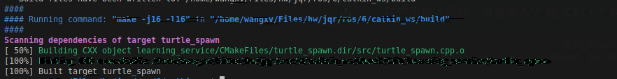
- 运行  
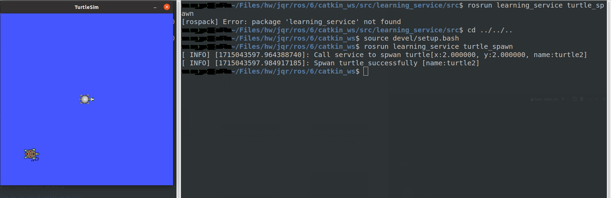
### `python`
-  运行
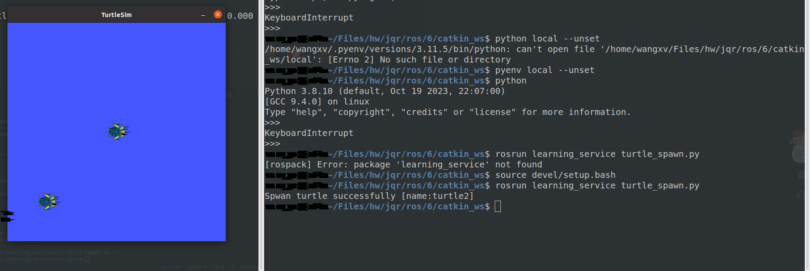  
## 服务端
### `cpp`
- 编译运行  
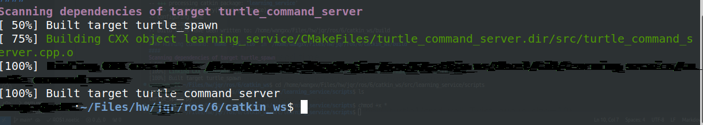
- 运行结果  
  - 一次 
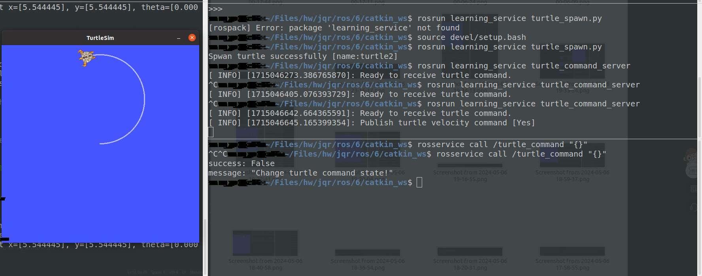  
  - 两次
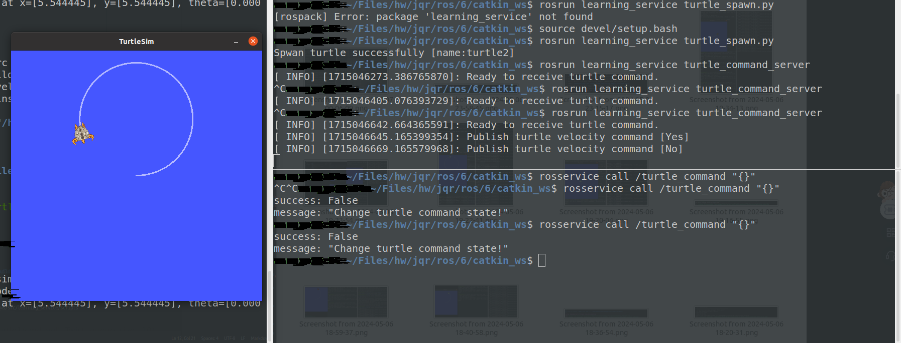
### `python`
- 运行结果
  - 一次
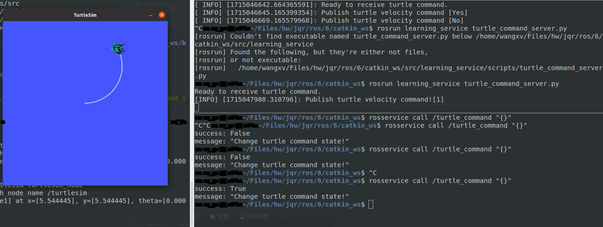
  - 两次
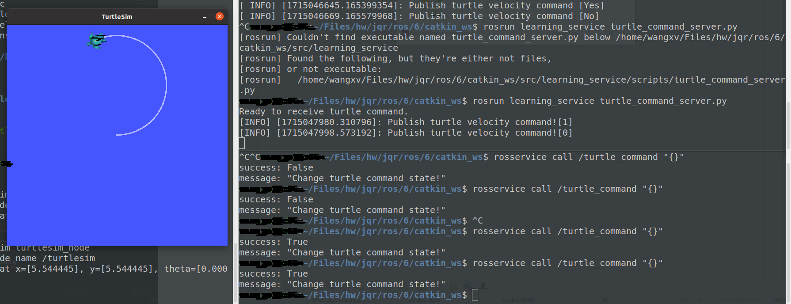
# 2
## 客户端
### `cpp`
- 编译
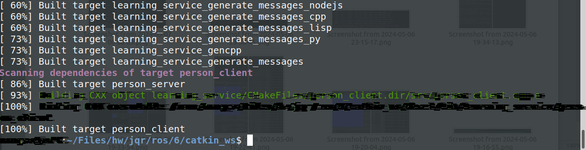
- 运行结果
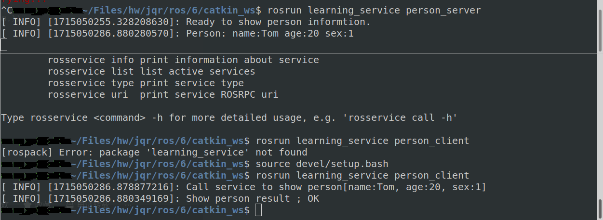
### `python`
- 运行
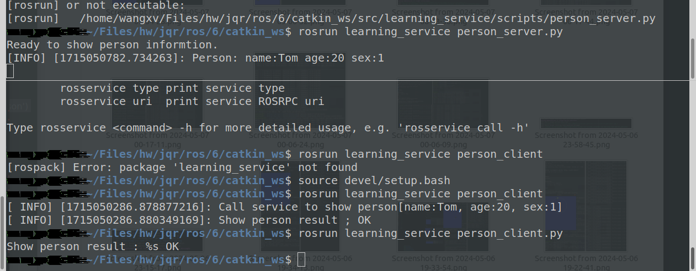