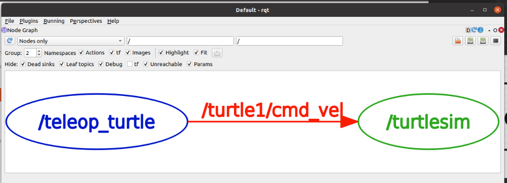
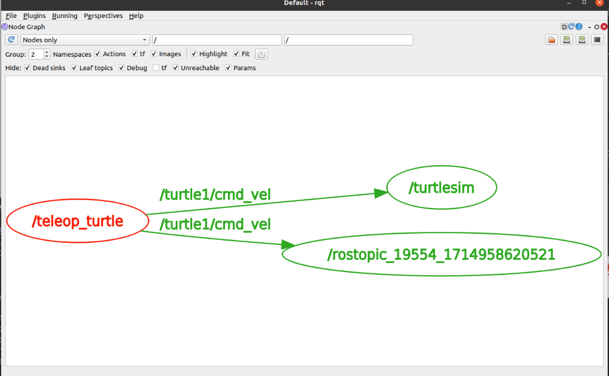
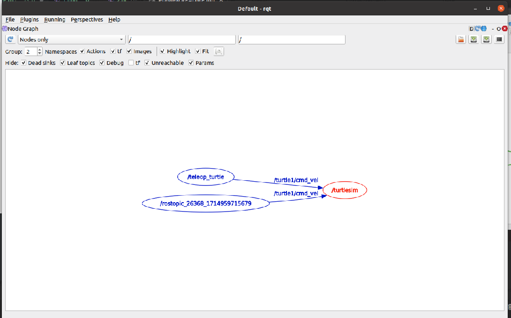
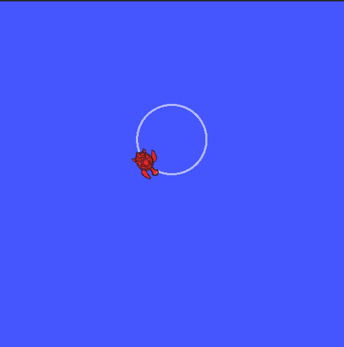
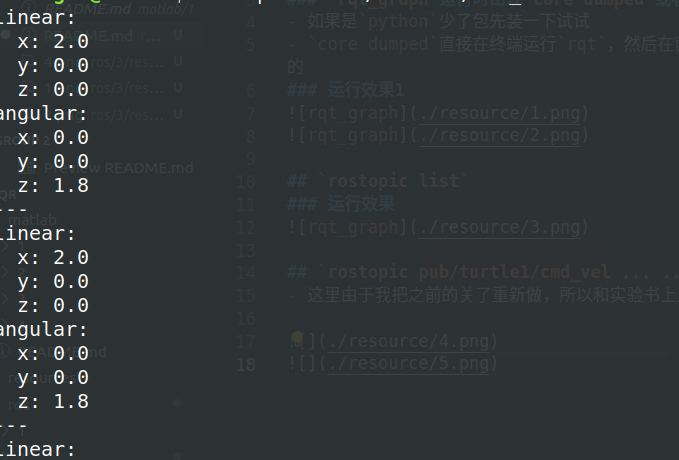
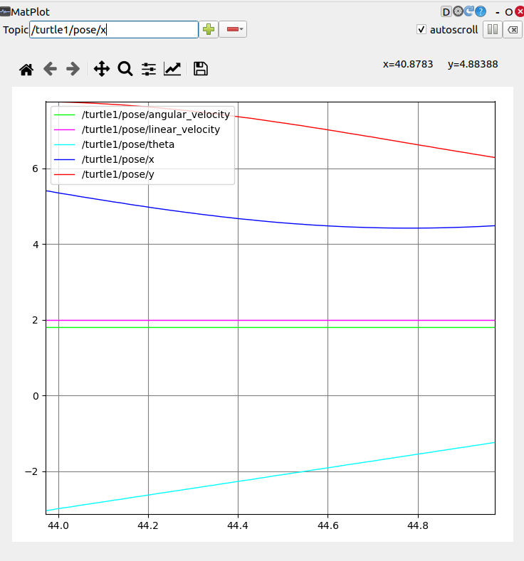
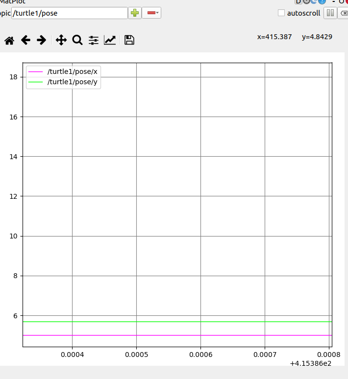
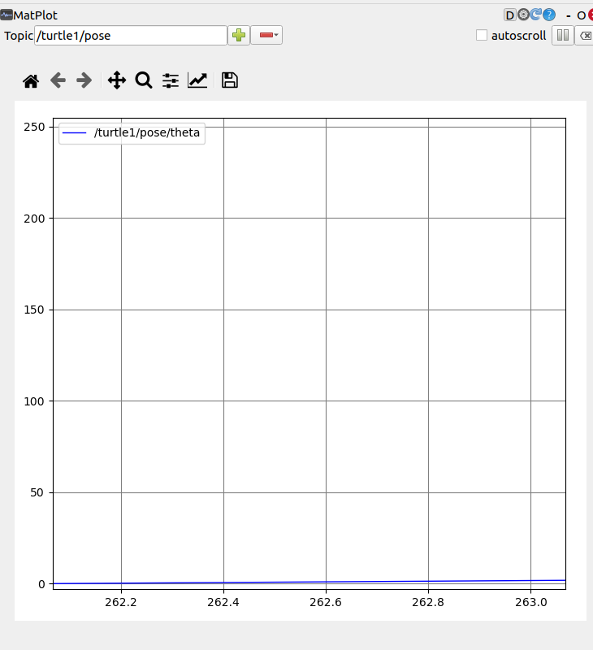

# 一些问题
## `rqt_graph`
### `rqt_graph`运行时出现`core dumped`或者 python 少了什么包
- 如果是`python`少了包先装一下试试
- `core dumped`直接在终端运行`rqt`，然后在窗口的`plugins`中找对应的`node graph`,不行的话试试其他的
### 运行效果1

## `rostopic list`
### 运行效果

## `rostopic pub/turtle1/cmd_vel ... ...`
- 这里由于我把之前的关了重新做，所以和实验书上比少了几个(之前的)，但是多的是一样的  

- 使用`rostopic echo`展示的

## `rqt_plot`
- 这里我才采用的仍然是终端运行`rqt`在窗口的`plugins`中找`plot`

- `x y`  

- `theta`      
