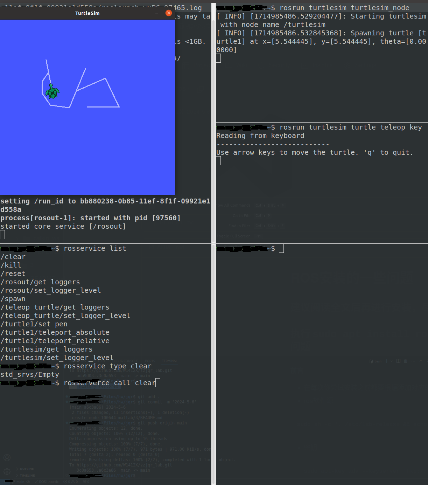
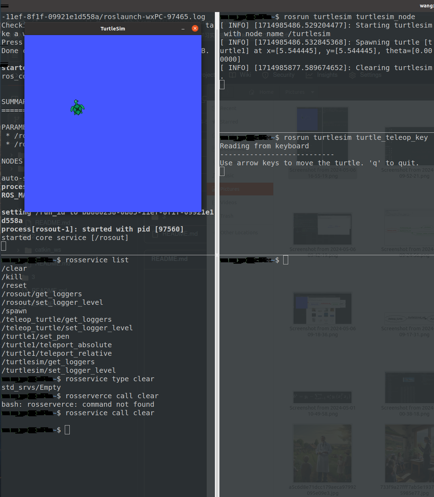
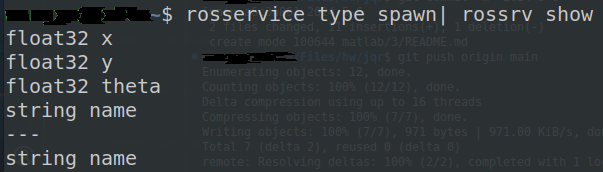
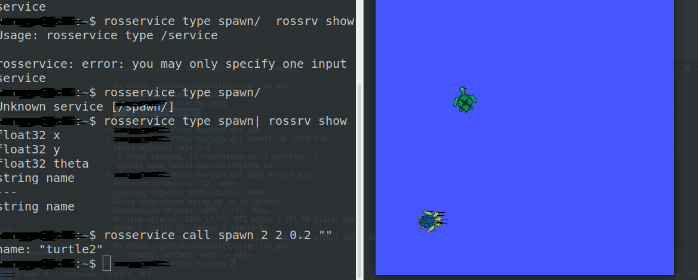
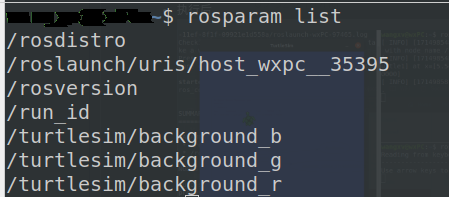
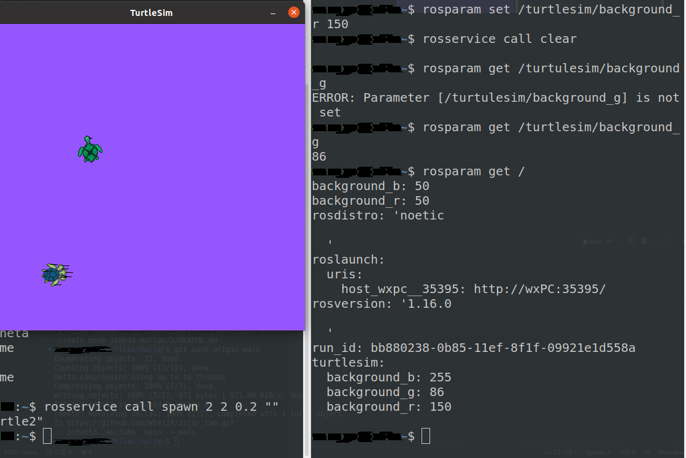
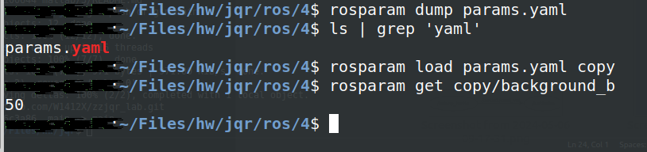

# 按照实验步骤
## ROS service
### `rosservice call clear`
- 执行前

- 执行后

### `rosservice call spawn` 
- 执行`rosservice call spawn| rossrv show`

- `call spawn`

## `rosparam`
### `rosparam list`

### `roparam get / set`
> 这里出了一个问题就是颜色不改变，我是指定服务的具体名称成功了
```shell
rosparam set /turtlesim/background_r 150
```


### `rosparam dump` and `rosparam load`
