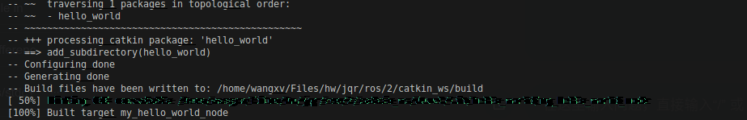

## 发布者设计
### 创建功能包

### 编译运行
- 这里我直接运行`catkin_make`没有编译对应的`learning_topic`，指定功能包才正常编译`catkin_make -DCATKIN_WHITELIST_PACKAGES="learning_topic"`  
  
### 运行
- 这里需要注意如果之前没有添加默认命令到`source ./devel/setup.bash`中的话，需要执行一次
- 运行结果  

### python 版本
- 注意也要执行一次 `source ./devel/setup.bash`  
-   

## 订阅者设计
### 编译运行
  
### 运行
- 海龟位置没有变化  

- 运行`ros run learning_topic velocity_publisher`  

- python

## 自定义消息类型
> 如果报错的话就是仔细看一下你的报错，我的是python少了个包`no module named em`  
  - 解决(下载4.0以下的版本)
  ```shell
  pip3 install empy==3.3.4
  ```
- 按照要求修改配置文件编译后  

### 写person_publisher和person_subscriber程序 以及 编译
- 编译结果  

- 运行结果  

### python 版本
- 运行结果  

